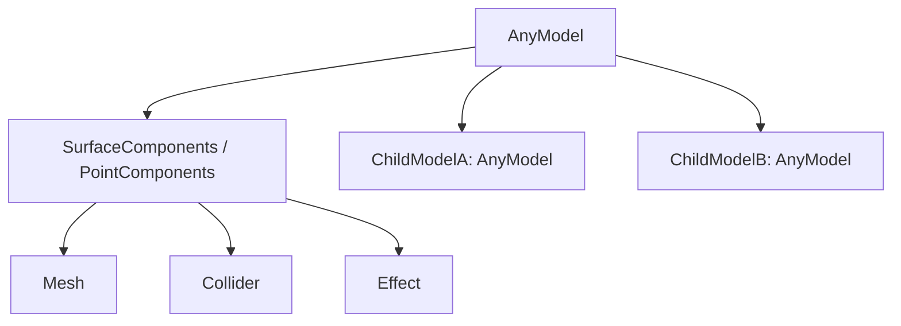

# AnyModel / AnyComponents 分離メモ

## 目的

AnyModel がモデル階層の管理に集中し、メッシュ・コライダー・エフェクトなどの内部構造は AnyComponents 側に閉じ込める。

## 推奨階層



## 役割分担

- AnyModel
  - 親子関係の管理
  - ChildModels / ParentModel の提供
  - 内部構造の生成先をコンポーネントへ委譲
- AnyComponents
  - Mesh / Collider / Effect の所有
  - 派生内部構造の追加
  - モデル種別ごとのノード構成の違いを吸収

## 実装方針

### AnyModel

- `_Ready()` では `CreateComponents()` を呼び、生成したコンポーネントを子に追加する。
- 既存のコード互換を維持するため、現在の既定コンポーネントは SurfaceComponents とする。
- モデル階層の列挙は `GetChildren().OfType<AnyModel>()` のまま使う。

### AnyComponents

- `Initialize()` で標準構造を一度だけ構築する。
- `Mesh` / `Collider` / `Effect` のような共通ノードは AnyComponents が保持する。
- SurfaceComponents / PointComponents は `InitializeDerivedComponents()` で個別の追加ノードを持てる。

## 利用例

```csharp
public partial class SurfaceModel : AnyModel
{
    protected override AnyComponents CreateComponents()
    {
        return new SurfaceComponents();
    }
}

public partial class PointModel : AnyModel
{
    protected override AnyComponents CreateComponents()
    {
        return new PointComponents();
    }
}
```

## 注意点

- コライダーは AnyComponents の子になるため、PickUtility のように AnyModel を逆引きする処理は親を一段ずつ辿る必要がある。
- AnyModel 側で Mesh / Collider / Effect を直接参照しない。
- AnyComponents の初期化は冪等にして、`_Ready()` と AnyModel 側の明示初期化が重なっても壊れないようにする。

## 既存フローへの影響

- モデルロード時は `LoadModelAsync` が `model.Components.Mesh` に glTF シーンを追加する。
- コライダー生成時は `ModelColliderBuilder` が `model.Components.Collider` を使う。
- ピック結果のモデル解決はコライダーの祖先から AnyModel を探索する。
- RootModel は Main シーン固定配置ではなく、ModelService 直下に動的生成する。