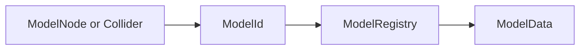

# ModelId 中心運用ガイド

## 目的

モデルの本体とビューを分離し、ロジックの中心を ModelData と ModelRegistry に統一する。

## 適用範囲

- Model, Selection, Pick, UI ツリー連携を含む C# 実装
- Signal, Event, RayCast, UI 選択通知の payload 設計

## 用語

- ModelDto: CSV, IPC, JSON などの外部入力を受け取る軽量 DTO
- ModelData: Guid で識別されるモデル本体
- ModelNode: ModelData を可視化する Godot ビュー
- ModelId: ModelData.Id を指す Guid

## 必須ルール

### 1. ロジック中心

- ロジックの中心は ModelData と ModelRegistry とする。
- ModelNode は再生成可能な軽量ビューとして扱う。

### 2. イベント運搬

- Signal, Event, UI 通知, Pick 結果は ModelNode 参照を直接運ばず ModelId を運ぶ。
- Godot Signal 層は string payload で運び、受信直後に Guid.TryParse で Guid へ変換する。
- Guid への変換に失敗した payload は処理せず、警告ログを出して破棄する。

### 3. ルーティング

- ルーティングは次の順序を必須とする。

- ModelNode が必要な場合のみ、ModelId からビュー探索して一時解決する。

### 4. 命名規約

- ModelNode 型の変数名は modelNode
- ModelData 型の変数名は modelData
- Guid 型のモデル識別子は modelId

### 5. 状態管理

- ロード状態, 表示状態, 階層状態は ModelData.Status を正として扱う。
- ModelNode 側は状態を保持せず、ModelData 状態の反映に専念する。

## 禁止事項

- Signal の payload に Guid を直接定義すること
- Signal, Event の payload に ModelNode を直接定義すること
- ModelData から ModelNode 参照を長期保持すること

## 実装チェックリスト

- Signal delegate のモデル引数が string modelId になっている
- ハンドラ先頭で Guid.TryParse を行っている
- Selection の内部管理が ModelId 集合になっている
- PickResult が ModelId を保持している
- UI バインダが ModelId で引ける

## 備考

- 既存実装との移行期間中は、ModelNode 側の補助探索を許容する。
- 新規実装では、ModelNode 生成時に必ず ModelId を明示設定する。